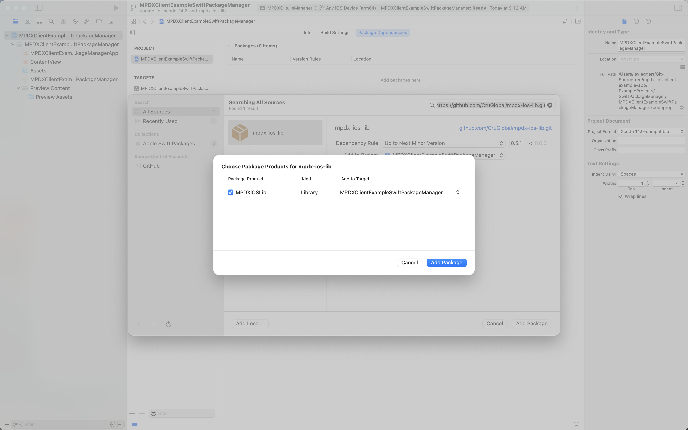
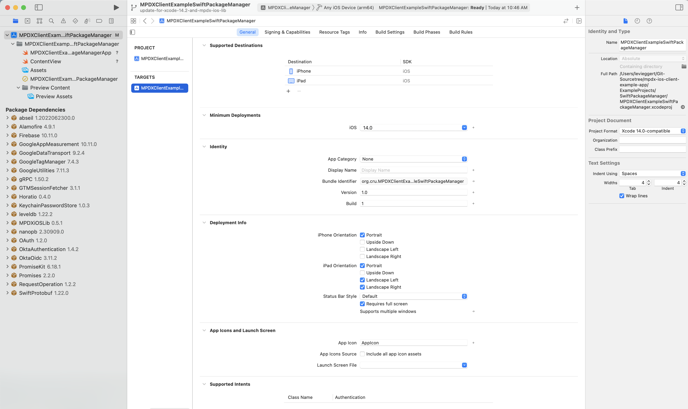
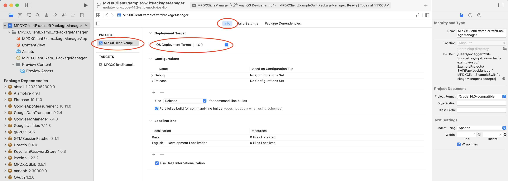
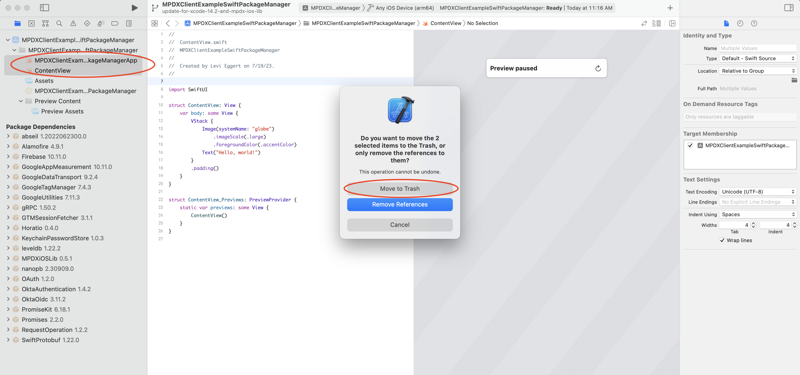
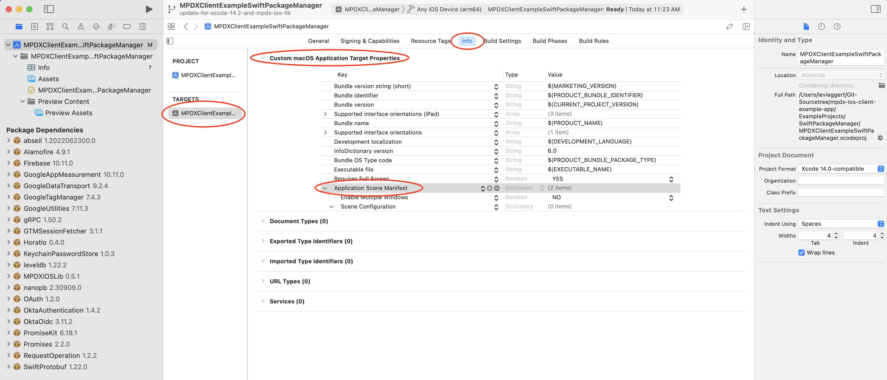

MPDX Client Example App
=======================

Includes Swift Package Manager and Cocoapods example projects to facilitate in the creation of your templated MPDX iOS App.

### Requirements

- Xcode Version: 14.2  
- Minimum iOS Target: iOS 14  
- Dependency Manager: Swift Package Manager or Cocoapods  

### Steps To Create Templated MPDX iOS App

Follow these outlined steps to get your Xcode project setup and running against the MPDXiOSLib code-base.

- [Create A New Xcode Project](#create-a-new-xcode-project)
- [Install The MPDXiOSLib Dependency](#install-the-mpdxioslib-dependency)
- [Configure Your New Xcode Project](#configure-your-new-xcode-project)
- [Configure Your App](#configure-your-app)

### Create A New Xcode Project

Start by creating a new Xcode project. Make sure to choose the following when creating your new Xcode project.

- For the project template choose App.
- Ensure Use Core Data is not checked.
- If you wish to include your own tests then check include Tests otherwise you can leave this unchecked.

### Install The MPDXiOSLib Dependency

Choose 1 of the next 2 steps to install the MPDXiOSLib dependency.

NOTE: You can view the latest MPDXiOSLib version either [here](https://github.com/CruGlobal/mpdx-ios-lib/blob/develop/MPDXiOSLib.podspec#L4) or [here](https://github.com/CruGlobal/mpdx-ios-lib/tags).

- [Install MPDXiOSLib With Swift Package Manager](#install-mpdxioslib-with-swift-package-manager)
- [Install MPDXiOSLib With Cocoapods](#install-mpdxioslib-with-cocoapods)

### Install MPDXiOSLib With Swift Package Manager

- Do it yourself following the [Swift Package Manager Documentation](https://developer.apple.com/documentation/xcode/adding-package-dependencies-to-your-app) or follow these steps below.
  - Locate your Xcode project package dependencies and tap the add icon to add the MPDXiOSLib git repo.
       
  - In the search field add the MPDXiOSLib git repo https://github.com/CruGlobal/mpdx-ios-lib.git.  
  - Set Dependency Rule to Up to Next Minor Version.
  - View latest MPDXiOSLib version either [here](https://github.com/CruGlobal/mpdx-ios-lib/blob/develop/MPDXiOSLib.podspec#L4) or [here](https://github.com/CruGlobal/mpdx-ios-lib/tags).
  - Add Package. 
       
  - Lastly, add the package after Xcode finishes loading the package.
       

### Install MPDXiOSLib With Cocoapods

- First install the [cocoapods dependency manager](https://cocoapods.org/).
- Add a Podfile to your project directory.  You can review the MPDXClientExampleCocoapods Podfile for reference on setting that up [here](https://github.com/CruGlobal/mpdx-ios-client-example-app/blob/update-for-xcode-14.2-and-mpdx-ios-lib/ExampleProjects/Cocoapods/Podfile).  NOTE that your target name or names(if including tests) will be different than the MPDXClientExampleCocoapods target name.  The main target name will match the Xcode project name.
- View latest MPDXiOSLib version either [here](https://github.com/CruGlobal/mpdx-ios-lib/blob/develop/MPDXiOSLib.podspec#L4) or [here](https://github.com/CruGlobal/mpdx-ios-lib/tags).
- Open the Terminal app to your Xcode project directory and run command pod install.  Once completed you will have a .xcworkspace file which you can now open to configure and build your app.

    
### Configure Your New Xcode Project

- Now it's time to finish configuring your Xcode project. 
- The Xcode file to open will depend on the dependency manager used.    
  - For Swift Package Manager open the .xcodeproj file.  
  - For Cocoapods open the .xcworkspace file (Generated from pod install).  
- Configure your Xcode project build target.
  - Delete Mac under Supported Destinations.
  - Set Minimum Deployment to iOS 14.0.
  - Set iPhone Orientation to Portrait.
  - Set iPad Orientation to Portrait, Landscape Left, Landscape Right.
  - Set Status Bar Style to Default.
  - Check Requires full screen.
       
- Configure your Xcode project info.
  - Set the Deployment Target to iOS 14.
       
- Delete the .swift files that Xcode generated for SwiftUI projects.
  - Select the ContentView.swift and "YourProjectName"App.swift file and hit the delete key.
  - Choose the Move to Trash option.
       
- Add Application Scene Manifest to Xcode build target info.
  - In your Xcode project info section, locate the Custom macOS Application Target Properties section.
  - Tap the plus icon on the bottom row option which will bring up a new row and start typing Application Scene Manifest.  Xcode should auto find this and tap enter when it does.  You should now see the added Application Scene Manifest and that's it.
       

- Open the .xcworkspace file that was created from the pod install command in the previous step.
- Locate the Info.plist file (Located in the same directory as AppDelegate.swift) and delete the node named (Application Scene Manifest).

- Delete these 3 files SceneDelegate.swift, Main.storyboard, and ViewController.swift.

- Select your main target then select the general tab.  In the Deployment Info section remove Main as the Main Interface.  This box should be empty.  Set your deployment target to iOS 14 and check mark the devices and orientations.

    
### Configure Your App

App configuration is done at run-time and requires that you initialize an App instance with a configuration that conforms to AppConfigInterface. You can view the example’s AppDelegate.swift and AppConfig.swift to see how this is setup.
