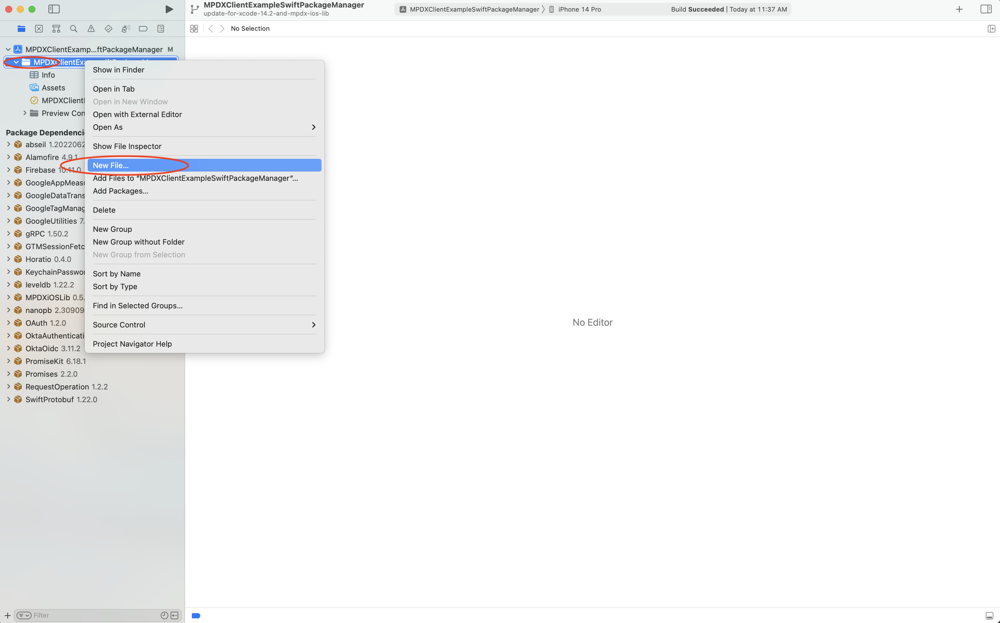
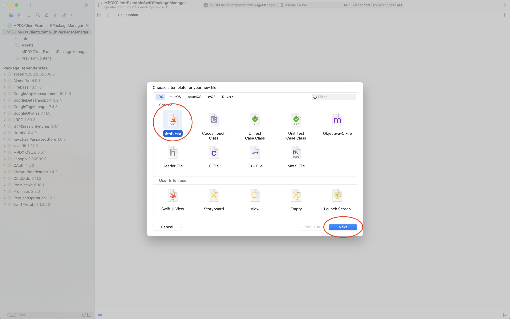
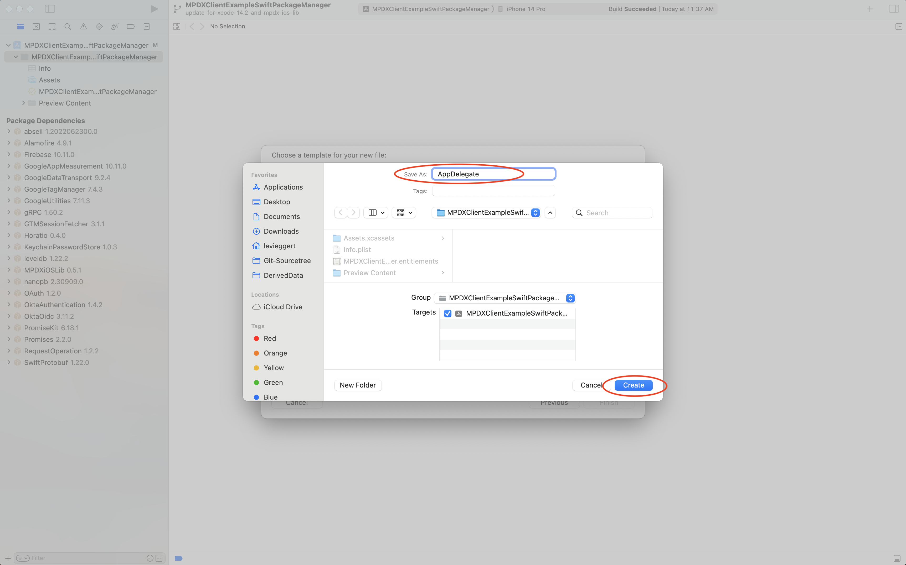
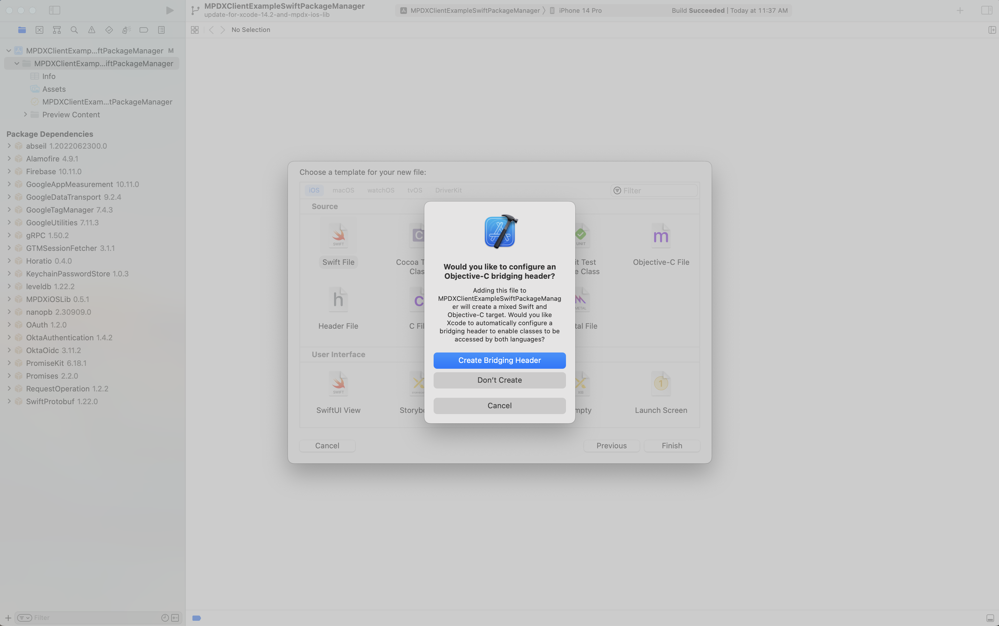
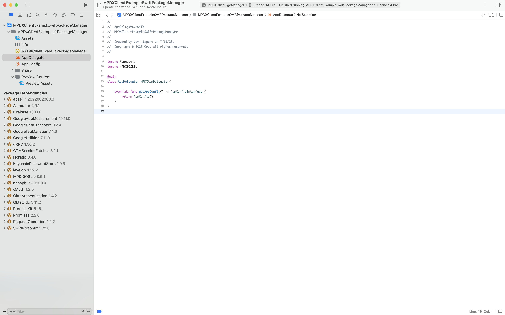
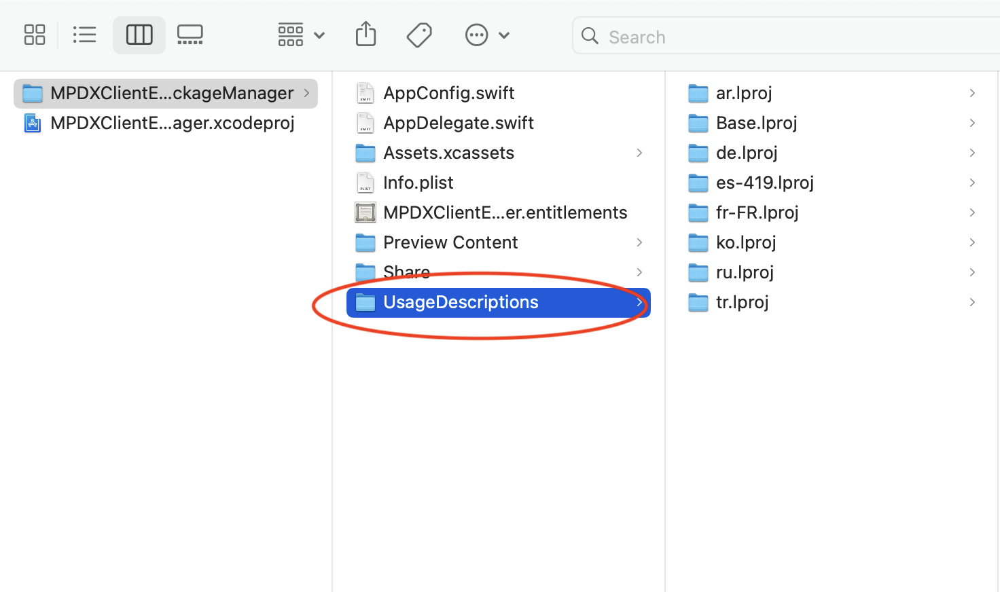
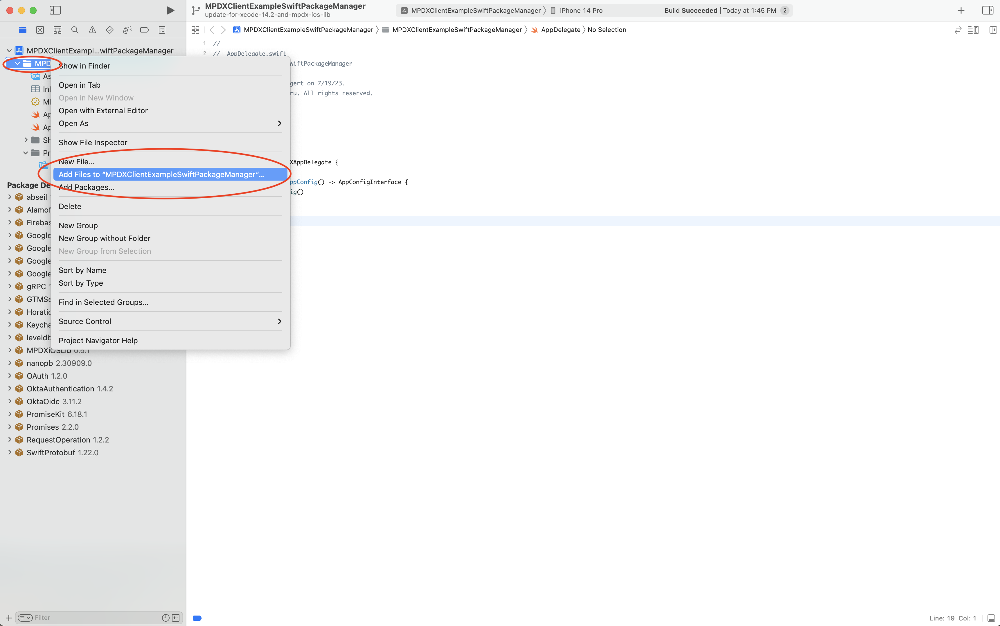
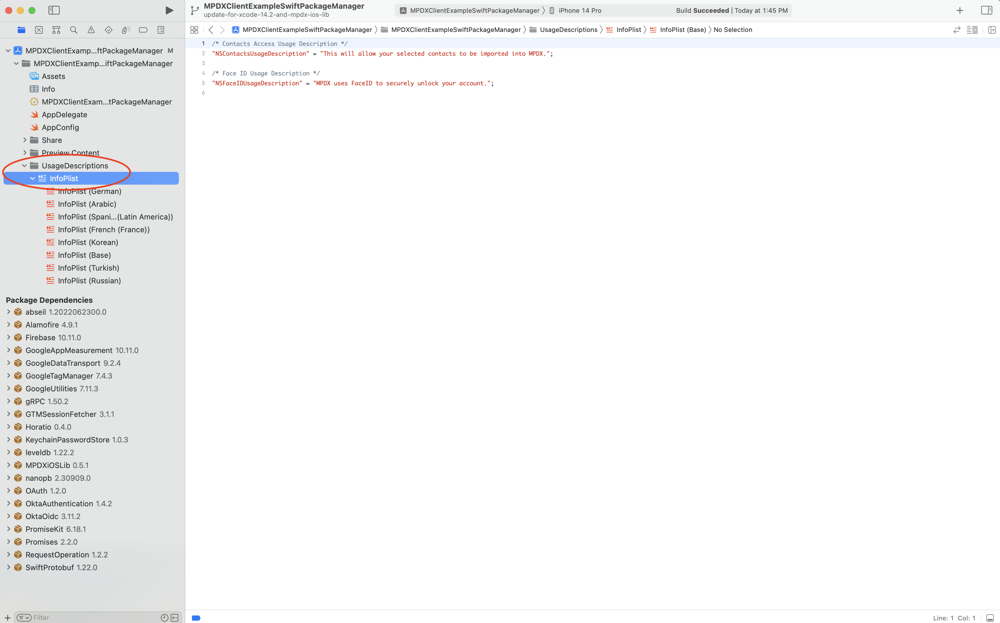

MPDX Client Example App
=======================

Includes Swift Package Manager and Cocoapods example projects to facilitate in the creation of your templated MPDX iOS App.

### Requirements

- Xcode Version: 14.2  
- Minimum iOS Target: iOS 14  
- Dependency Manager: Swift Package Manager or Cocoapods  

### Steps To Create Templated MPDX iOS App

Follow these outlined steps to get your Xcode project setup and running against the MPDXiOSLib code-base.

- [Create A New Xcode Project](#create-a-new-xcode-project)
- [Install The MPDXiOSLib Dependency](#install-the-mpdxioslib-dependency)
- [Configure Your New Xcode Project](#configure-your-new-xcode-project)

### Create A New Xcode Project

Start by creating a new Xcode project. Make sure to choose the following when creating your new Xcode project.

- For the project template choose App.
- Ensure Use Core Data is not checked.
- If you wish to include your own tests then check include Tests otherwise you can leave this unchecked.

### Install The MPDXiOSLib Dependency

Choose 1 of the next 2 steps to install the MPDXiOSLib dependency.

NOTE: You can view the latest MPDXiOSLib version either [here](https://github.com/CruGlobal/mpdx-ios-lib/blob/master/MPDXiOSLib.podspec#L4) or [here](https://github.com/CruGlobal/mpdx-ios-lib/tags).

- [Install MPDXiOSLib With Swift Package Manager](#install-mpdxioslib-with-swift-package-manager)
- [Install MPDXiOSLib With Cocoapods](#install-mpdxioslib-with-cocoapods)

### Install MPDXiOSLib With Swift Package Manager

- Swift Package Manager Documentation is [here](https://developer.apple.com/documentation/xcode/adding-package-dependencies-to-your-app).
- Locate your Xcode project package dependencies and tap the add icon to add the MPDXiOSLib git repo.
     
- Enter the repo https://github.com/CruGlobal/mpdx-ios-lib.git in the search field.  
- Set Dependency Rule to Up to Next Minor Version.
- Set the minimum version. You can view the latest MPDXiOSLib version [here](https://github.com/CruGlobal/mpdx-ios-lib/blob/master/MPDXiOSLib.podspec#L4) or [here](https://github.com/CruGlobal/mpdx-ios-lib/tags).
- Add the Package. 
     
- Xcode will finish loading, then add package to target.
     

### Install MPDXiOSLib With Cocoapods

- First install the [cocoapods dependency manager](https://cocoapods.org/).
- Add a Podfile to your project directory.  You can review the MPDXClientExampleCocoapods Podfile for reference on setting that up [here](https://github.com/CruGlobal/mpdx-ios-client-example-app/blob/main/ExampleProjects/Cocoapods/Podfile).  NOTE that your target name or names(if including tests) will be different than the MPDXClientExampleCocoapods target name.  The main target name will match the Xcode project name.
- Also note the version might be later than the linked example.  Find the latest available version [here](https://github.com/CruGlobal/mpdx-ios-lib/blob/master/MPDXiOSLib.podspec#L4) or [here](https://github.com/CruGlobal/mpdx-ios-lib/tags).
- Open the Terminal app to your Xcode project directory and run command pod install.  Once completed you will have a .xcworkspace file which you can now open to configure in the next step.

    
### Configure Your New Xcode Project

- Now it's time to finish configuring your Xcode project. 
- The Xcode file to open will depend on the dependency manager used.    
  - For Swift Package Manager open the .xcodeproj file.  
  - For Cocoapods open the .xcworkspace file (Generated from pod install).  
- Configure your Xcode project build target.
  - Delete Mac under Supported Destinations.
  - Set Minimum Deployment to iOS 14.0.
  - Set iPhone Orientation to Portrait.
  - Set iPad Orientation to Portrait, Landscape Left, Landscape Right.
  - Set Status Bar Style to Default.
  - Check Requires full screen.
       
- Configure your Xcode project info.
  - Set the Deployment Target to iOS 14.
       
- Delete the .swift files that Xcode generated for SwiftUI projects.
  - Select the ContentView.swift and "YourProjectName"App.swift file and hit the delete key.
  - Choose the Move to Trash option.
       
- Add Application Scene Manifest to Xcode build target info.
  - In your Xcode target info section, locate the Custom macOS Application Target Properties section.
  - Tap the plus icon on the bottom row option which will bring up a new row and start typing Application Scene Manifest.  Xcode should auto find this and tap enter when it does.  You should now see the added Application Scene Manifest and that's it.
       
- Add AppDelegate.swift.
  - Right click on project folder and add new file.
       
  - Choose swift file template.
       
  - Input AppDelegate for name and choose Create. Don't create bridging header.
       
  - If Xcode requests to configure an Objective-C briding header choose Don't Create.
       
  - Complete the AppDelegate.swift implementation. An example is [here](https://github.com/CruGlobal/mpdx-ios-client-example-app/blob/main/ExampleProjects/SwiftPackageManager/MPDXClientExampleSwiftPackageManager/AppDelegate.swift).
       
  - AppDelegate.swift will need an instance conforming to AppConfigInterface.swift.  See the next step for setting this up.
- Add AppConfig.swift.  Follow the same instructions you used for adding the AppDelegate.swift file and add AppConfig.swift.
  - For an AppConfig.swift reference you can view that [here](https://github.com/CruGlobal/mpdx-ios-client-example-app/blob/main/ExampleProjects/SwiftPackageManager/MPDXClientExampleSwiftPackageManager/AppConfig.swift).
  - Set your apiBaseUrl: String.
  - Set your authenticationConfiguration: AuthenticationConfiguration.
- Add usage descriptions. These are descriptions apple looks for when a user attempts to access device contacts or device face id. These files can't be bundled with  MPDXiOSLib and instead must be manually added to your Xcode project.
  - Download MPDXiOSLib zip [here](https://github.com/CruGlobal/mpdx-ios-lib/archive/refs/heads/master.zip).
  - In finder look in the downloaded directory for /Sources/MPDXiOSLib/Resources/UsageDescriptions/ and copy the UsageDescriptions directory into your project directory where Assets.xcassets, Info.plist, and .entitlements live. Make sure you're in finder and not the Xcode project.
       
  - Back in Xcode right click your project directory and choose Add Files and choose the Usage Descriptions directory you just added. Ensure Create groups is checked.
       
       
  - You should now see the Usage Descriptions InfoPlist files in your Xcode project.
       
  - That's it. You should now be able to build and run Xcode. 
