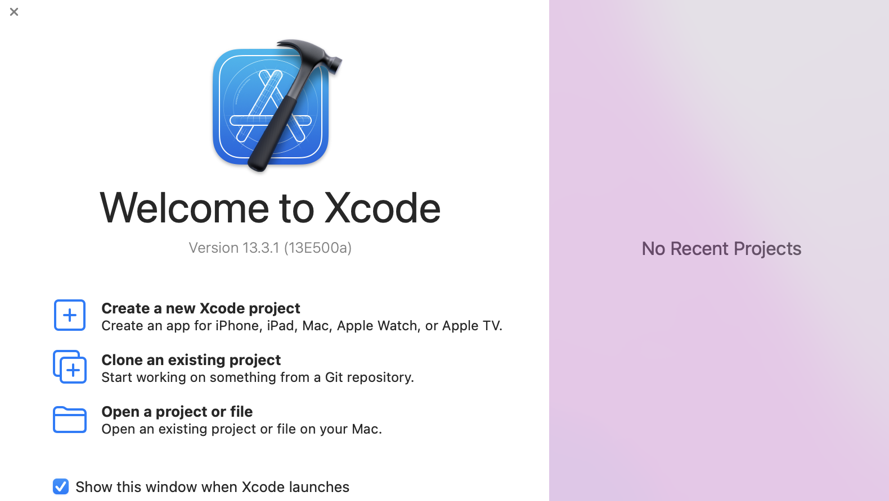
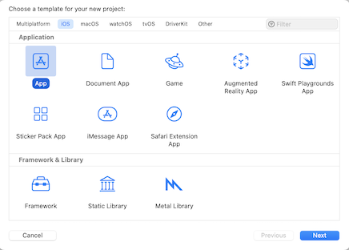

MPDX Client Example App
=======================

The purpose of this project is to facilitate in the creation of your templated MPDX iOS app.  Here you can view how we setup this example Xcode project when setting up your own Xcode project.

- [Configuring Your Xcode Project](#configuring-your-xcode-project)
- [Configuring Your App](#configuring-your-app)

### Configuring Your Xcode Project

1. Start by creating a new Xcode project.

2. Choose App for the project template.

### Configuring Your App
